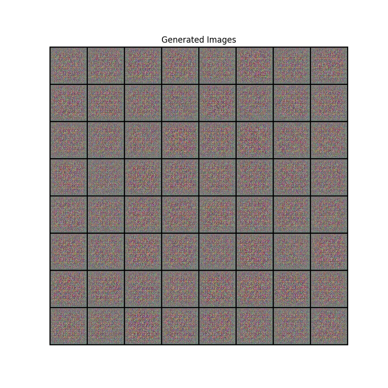
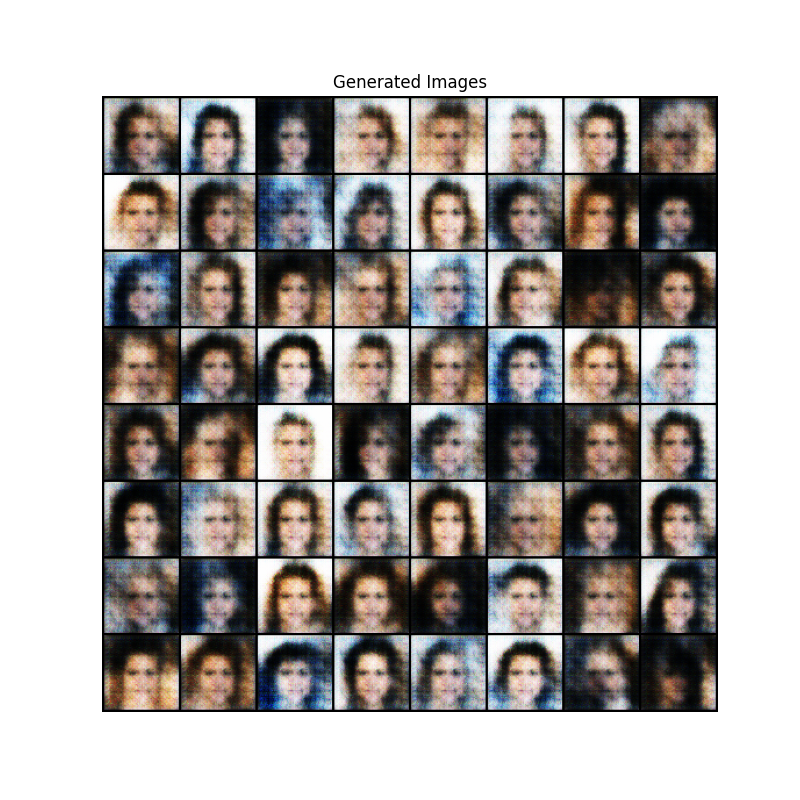
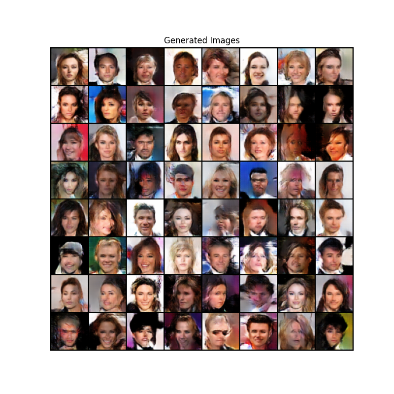

# Overview
Human-face Generation task based on DCGAN, using the CelebA dataset, which contains 202,599 face images of 10,177 celebrities. (P.S. This was a time-limited outsourcing project. )
### Visualization of the Iteration Process



# Quick Start
The following describes how this project will be deployed. 
Reference Tutorial: [DCGAN实现面孔生成（Celeb-A数据集）](https://blog.csdn.net/t1274171989/article/details/134192698)

## Dataset
Download the CelebA Dataset from Huggingface by **hfd**.
### Instructions
1. download hfd：
```
wget https://hf-mirror.com/hfd/hfd.sh
chmod a+x hfd.sh
```

2. install aria2:
```
sudo apt update
sudo apt install aria2
```

3. set environment variables: 
```
Linux：export HF_ENDPOINT=https://hf-mirror.com
Windows Powershell：$env:HF_ENDPOINT = “https://hf-mirror.com”
```

4. download dataset: 
```
./hfd.sh nielsr/CelebA-faces --dataset
```

## Run
1. Deploy the code for this project：

```bash
git clone https://github.com/yediong/DCGAN_Face_Generation.git
```

2. Move in the dataset and modify the path.

3. Process the original data of parquet type, so that it can be processed faster when reading data later.
```bash
python preprocess_parquet.py
```

4. Train: 
```bash
python DCGAN.py
```

5. Test: 
- Generate n face images and save them in the generate_images file directory.
```bash
python generate_faces.py
```

## usage
Adjust the relevant hyperparameters (batch_size, lr, beta1 of Adam optimizer, etc.) to improve the quality of generated images. Since this project is completed in one hour, the parameter adjustment is relatively hasty.

# Notes
Check *Project Report.pdf* for more details. 

**Plus: This outsourcing project earned me a small profit of 110 RMB, haha.
**
